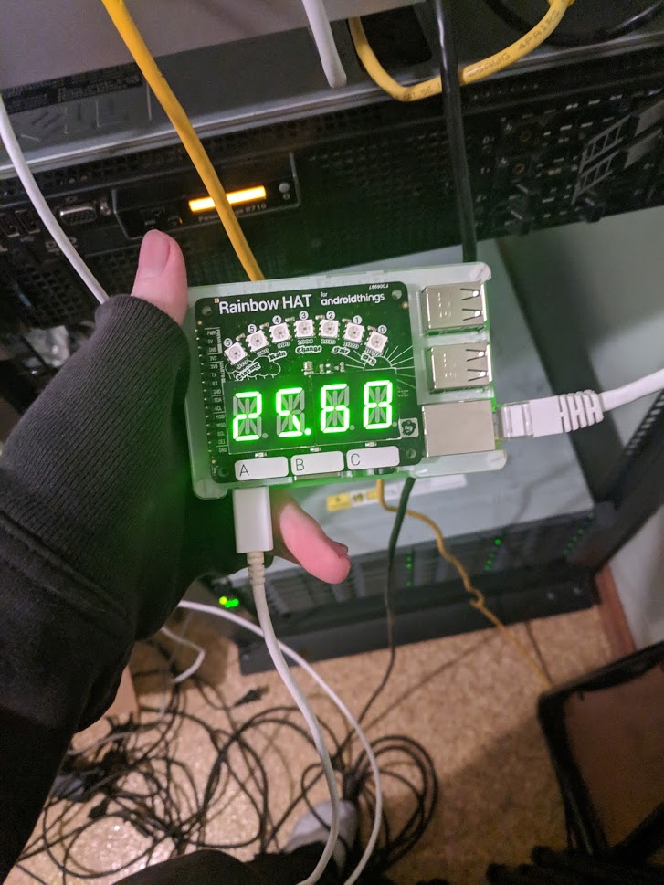

# Pihole Statistics for Pimoroni Rainbow HAT
This script in this repository allows for displaying how many DNS requests are being blocked on your [PiHole](https://pi-hole.net/) in the form of a percentage on your [Rainbow HAT](https://shop.pimoroni.com/products/rainbow-hat-for-android-things).



### Installation
This repository makes use of Python 3 and libraries for the PiHole and Rainbow HAT.
```python
# Install PiHole API
python3 -m pip install --no-cache-dir PiHole-api

# Install Rainbow HAT
python3 -m pip install rainbowhat

# Clone the repository
git clone https://github.com/elycin/pihole-stat-rainbow-hat.git

# Move into the directory
cd pihole-stat-rainbow-hat

# Edit the script's very bottom and specify the administration password.
nano pihole-display-percentage.py

# Run the script with Python 3
python3 ./pihole-display-percentage.py
```

### Starting at boot
1. Make sure you have the `screen` command installed.
2. Append the following line to your crontab.
```
@reboot screen -S pihole_script -d -m /path/to/repository/pihole-display-percentage.py
```