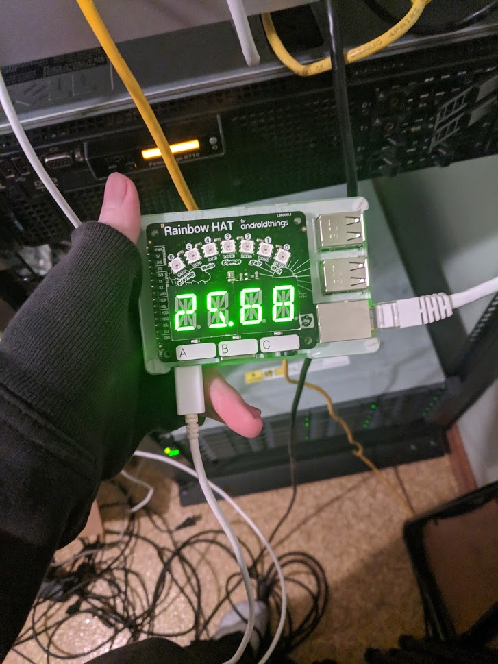

# PiHole Statistics for Pimoroni Rainbow HAT
This script in this repository allows for displaying how many DNS requests are being blocked on your [PiHole](https://pi-hole.net/) in the form of a percentage on your [Rainbow HAT](https://shop.pimoroni.com/products/rainbow-hat-for-android-things).



### Installing dependencies
For this repository, you will need to download the following dependencies via `pip3`.  
Example syntax: `pip3 install <package>`  

Packages:
- `PiHole-api`
- `rainbowhat`


### Configuration
As of a recent commit, a dedicated configuration file has been made for an easy updating process for when updates have been made for this script.  

Please edit `configuration.py` and edit accordingly.
```python
# IP of where the Pi-hole panel runs.
server_ip = "127.0.0.1"

# Password - not the API token!
server_password = "your_password_here"

# Number of seconds before the Rainbow HAT updates.
update_frequency = 10
```

### Running the script
If you choose to, you can manually invoke the script by running it via `python3`.
```bash
python3 ./pihole_stat_rainbow_hat.py
```

### Updating the script
From time to time I may choose to update the scripts to add more features.  
You can update local version of your project by running `git pull` in the directory of the cloned repository to pull the latest changes while keeping your configuration.

### Create a systemd service
A command has been made to make this process easy and dynamically find PATH variables for your environment.  
Run the following command to create a service on your Raspberry Pi.
```bash
bash create-service.sh
```

### Deleting the service
Service files are created in the following path: `/etc/systemd/system/`  
Please run the following command to delete the service from your Raspberry Pi so you can safely delete the repository without causing conflicts.
```bash
rm /etc/systemd/service/pihole-stat-rainbow-hat.service
```

### Starting the service manually
Run this command to start the service manually after creating the service.
```bash
systemctl start pihole-stat-rainbow-hat
```

### Start the service at boot
If you would like the script to automatically start when your Raspberry Pi turns on, run the following command:
```bash
systemctl enable pihole-stat-rainbow-hat 
```

### Disable start service at boot
```bash
systemctl disable pihole-stat-rainbow-hat
```